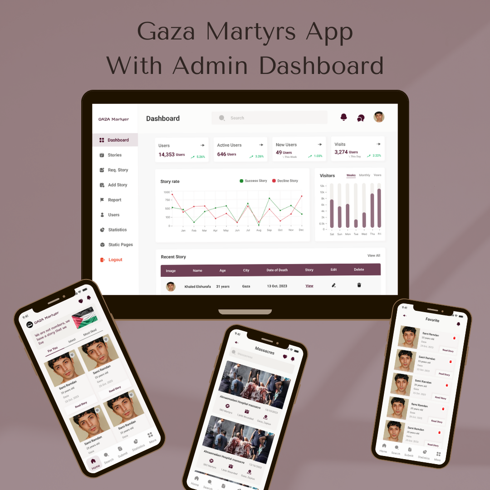
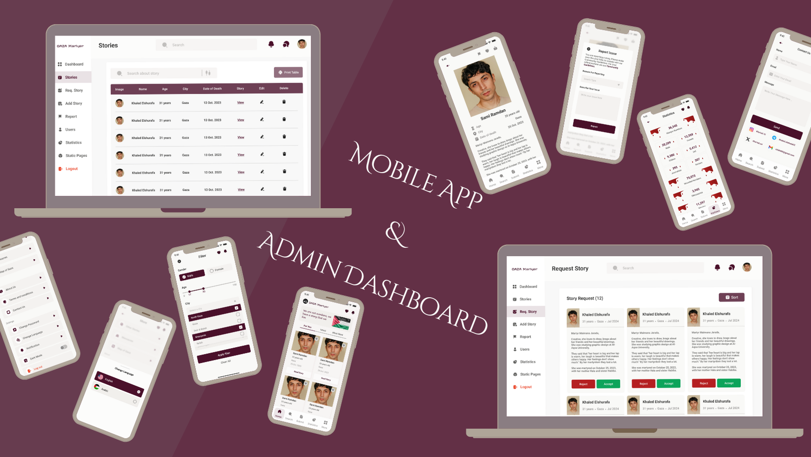
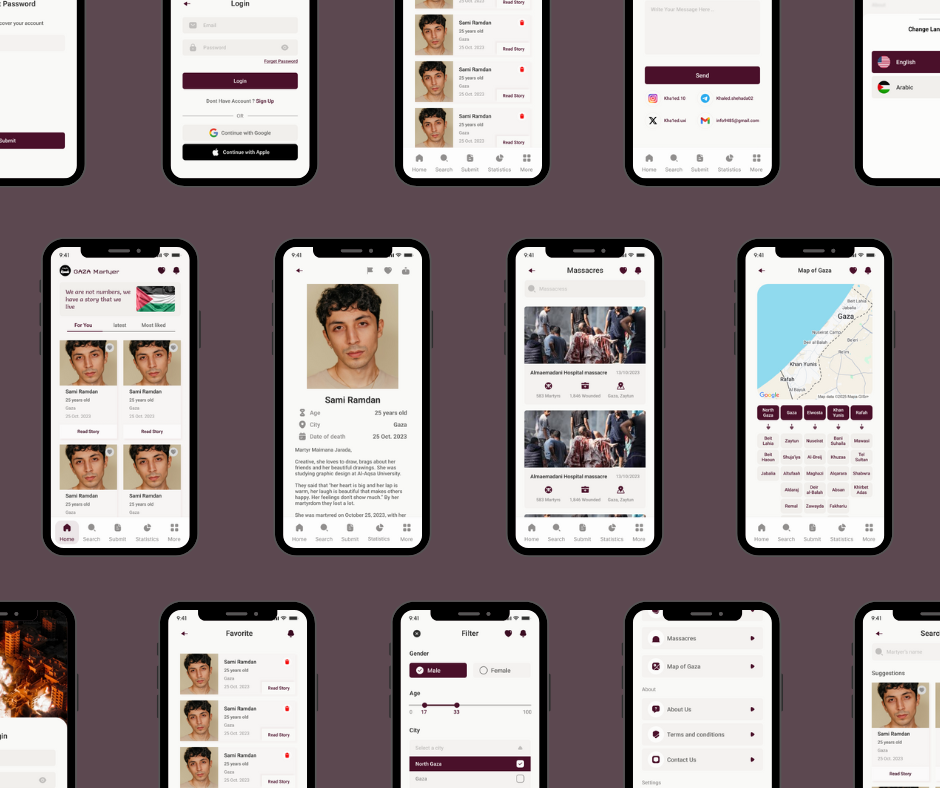

# 🕊️ Gaza Martyrs App

> 🇵🇸 A cross-platform Flutter application to honor and preserve the stories of Gaza’s martyrs — combining beauty, performance, and purpose.

---

## 📖 Project Overview

**Gaza Martyrs App** provides:
- 🧍‍♂️ A **user-friendly mobile interface** to browse, search, and read stories about martyrs.
- 🖥️ A **web/desktop admin panel** to manage stories, users, reports, and notifications.
- ☁️ A **Firebase-powered backend** with authentication, real-time data, and push notifications.
- 🖼️ **Cloudinary integration** for image uploads.
- 🌍 **Multilingual** and **responsive design** across devices.

---

## 🧩 Tech Stack

| Category | Technologies |
|-----------|---------------|
| **Framework** | Flutter (Dart SDK ^3.6.0) |
| **State Management** | GetX |
| **Backend Services** | Firebase (Auth, Firestore, Messaging) |
| **Cloud Storage** | Cloudinary |
| **UI/UX** | Flutter SVG, Google Fonts, Custom Themes |
| **Others** | Shared Preferences, Connectivity Plus, HTTP, UUID, JWT, FL Chart |

---

## 🏗️ Architecture

**Clean MVC-inspired architecture** with:
- 🧠 **Controllers:** Under `lib/controllers/` using GetX for state and logic management.
- 💾 **Services:** Firebase & Cloudinary integrations for authentication, data, and images.
- 🎨 **UI Layer:** Screens and widgets organized under `lib/screens/` and `lib/components/`.
- ⚙️ **Configuration:** Firebase setup via `lib/firebase_options.dart` and environment configs.
- 🔔 **Notifications:** Firebase Cloud Messaging (FCM) and local notifications system.

---

## ✨ Features

### 👥 User Features
- 🚀 Splash & onboarding screens  
- 🔐 Login / Sign-up / Password reset  
- 🏠 Home feed with martyrs’ cards (photo, name, city, date)  
- ❤️ Add / remove favorites  
- 🔍 Smart search and filters  
- 🕯️ Story detail view  
- 🔔 Notifications center  
- 🌐 Multilingual and dark mode  

### 🛠️ Admin Features
- 📊 Dashboard overview  
- 📚 Manage stories, users, reports, static pages  
- 📢 Send push notifications (to all or specific tokens)  
- 🖼️ Cloudinary-based image upload  
- 🧾 In-app version management  

---

## 🖼️ Screenshots

---

## 🌐 Social Links

- 👨‍💻 Developer: [ِAhmed Meqdad]
- 📧 Email: [ahmd2002mqdad@gamil.com]
- 💼 LinkedIn: [linkedin.com/in/ahmed-meqdad](https://www.linkedin.com/in/ahmed-meqdad)